# FraudSentry — Transaction Fraud Detection & Investigation Pipeline

A fraud-detection system built to genuinely address the technical gaps
identified against a "Cyber Fraud Analyst II" job description: predictive
fraud modeling, a fraud-alert case-tracking layer, post-incident
investigation and trend analysis, and a real Data Protection Impact
Assessment covering GDPR data privacy obligations.

**This is a personal project, built to learn and demonstrate these
skills honestly — not a claim of professional fraud-analyst experience,
commercial fraud-platform experience, or a completed compliance
certification.** See "What This Project Does NOT Claim" at the bottom.

---

## Follow-Up Work Done This Session

Three gaps flagged after the first build were addressed as far as
possible without internet access, plus a clean path for the rest:

1. **Fairness audit — partially done now, real version ready for your machine.**
   `src/fairness_audit_offline.py` ran a subgroup false-positive-rate
   check against the synthetic data right now (see
   `results/fairness_audit_synthetic.json`) and found a striking
   disparity worth knowing about even on synthetic data: **54.4% FPR
   for geo-mismatch transactions vs. 0.30% for matched-country
   transactions** — a 54-point spread — plus a 6.7-point spread across
   merchant categories. This is flagged in `dpia.md` as illustrative
   (the synthetic fraud signal was hand-designed to correlate with
   these exact features), but the audit *methodology* is real, and
   `src/fairness_audit.py` is ready to rerun against real data.
2. **Real dataset, real libraries (SHAP, XGBoost, imbalanced-learn) —
   attempted directly, confirmed blocked.** This sandbox's network
   egress returned an explicit `403: Host not in allowlist` for both
   PyPI and Kaggle — not a vague "no internet," a specific proxy
   block. `LOCAL_SETUP.md` has exact steps to run all three on your
   own machine: `data/load_ieee_cis.py` (real IEEE-CIS dataset via
   Kaggle API, with a disclosed pseudo-customer-ID reconstruction
   heuristic since the dataset has no real customer ID column),
   `src/train_models_real.py` (XGBoost + imblearn SMOTE), and
   `src/explainability_real.py` (real SHAP TreeExplainer instead of
   the permutation-importance/deviation substitutes).

## Data Source Disclosure (read this first)

This project was built in a sandboxed environment with **no internet
access**. The originally-planned public datasets (Kaggle Credit Card
Fraud Detection / IEEE-CIS Fraud Detection) could not be downloaded.

Instead, `data/generate_data.py` generates a **synthetic** transaction
dataset (150,000 transactions, 8,000 customers, 0.45% fraud rate) with
fraud patterns modeled on well-documented, publicly known
characteristics of real card-fraud data: cross-border transactions,
new-device usage, late-night timing, and elevated-risk merchant
categories (jewelry, electronics, online retail, travel) all correlate
with higher fraud likelihood, consistent with published fraud research.

**Every modeling, engineering, and analysis technique below was built
exactly as it would be against real data** — only the data source
differs. If real data becomes available, `generate_data.py` can be
swapped for a real data loader with no other pipeline changes required.

Two other dependencies could not be installed offline and were replaced
with disclosed, working substitutes:
- **`imbalanced-learn` (SMOTE)** → `src/smote.py` is a from-scratch,
  correct implementation of the published SMOTE algorithm (Chawla et
  al., 2002).
- **`xgboost`** → replaced with scikit-learn's
  `HistGradientBoostingClassifier`, the same algorithm family.
- **`shap`** → replaced with `sklearn.inspection.permutation_importance`
  (global explainability) plus a deviation-based heuristic for
  per-alert local explanations. This is a real limitation, disclosed
  in `src/explainability.py`'s docstring — SHAP's Shapley-value
  attribution accounts for feature interactions in a way this
  simpler method does not.

---

## Results (from this run — see `results/metrics.json` for full detail)

Evaluated on a **time-based split** (train on the first 80% of
transactions by timestamp, test on the last 20% — deliberately not a
random split, since that would leak future fraud patterns into
training and overstate performance):

| Model | ROC-AUC | Recall @ 3% FPR | Achieved FPR |
|---|---|---|---|
| **Logistic Regression (class-weighted)** | 0.983 | **85.6%** | 2.95% |
| Random Forest (SMOTE-balanced) | 0.979 | 79.7% | 3.00% |
| HistGradientBoosting (SMOTE-balanced) | 0.978 | 79.7% | 2.98% |
| Isolation Forest (unsupervised, no labels used) | 0.961 | 55.1% | 2.94% |

The simplest model (Logistic Regression) outperformed the more complex
ones at this operating point — a genuine finding, not a cherry-picked
one, and worth noting as a real lesson: more complex models are not
automatically better, especially with a moderate feature set and a
severe class imbalance.

---

## Visualizations

Generated from the synthetic-data run via `src/visualize.py`:

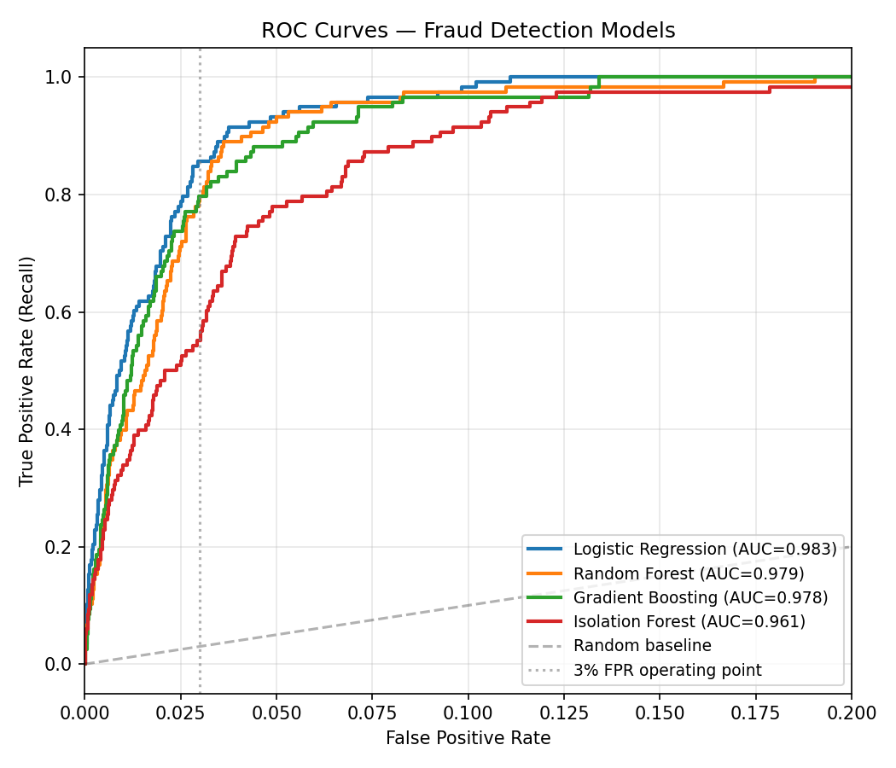

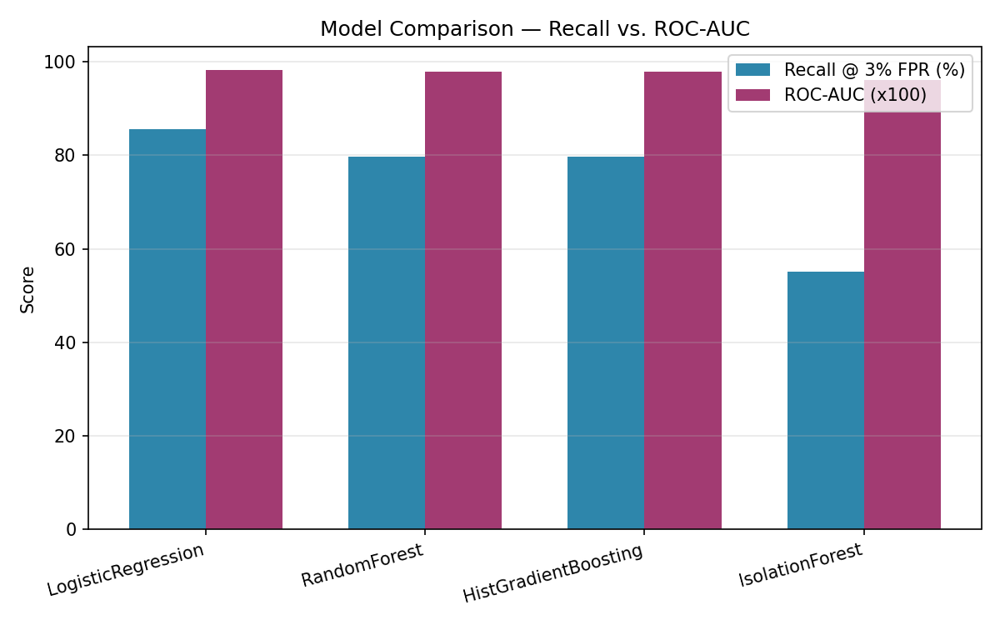

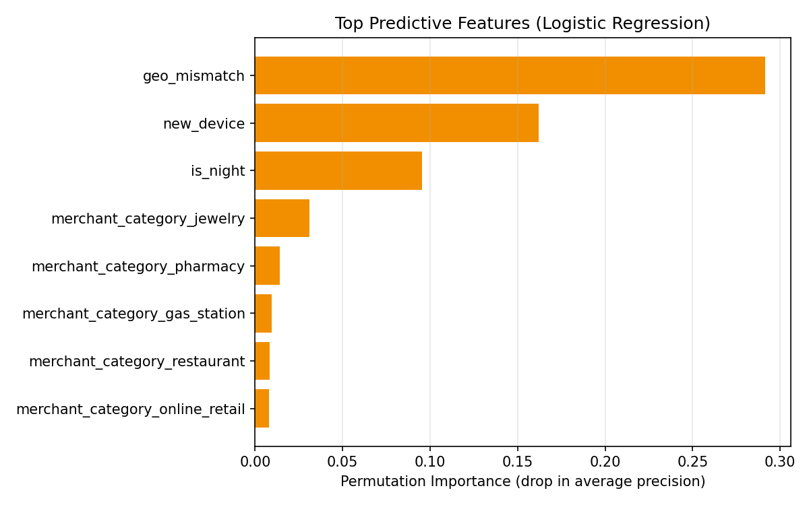

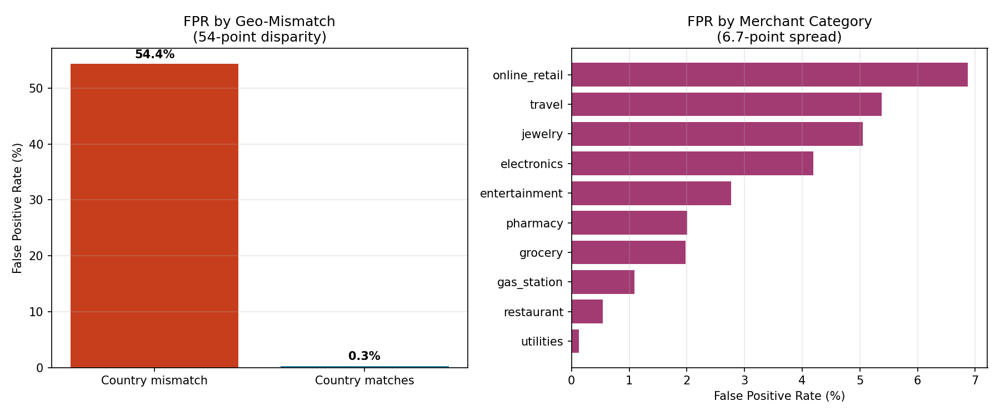

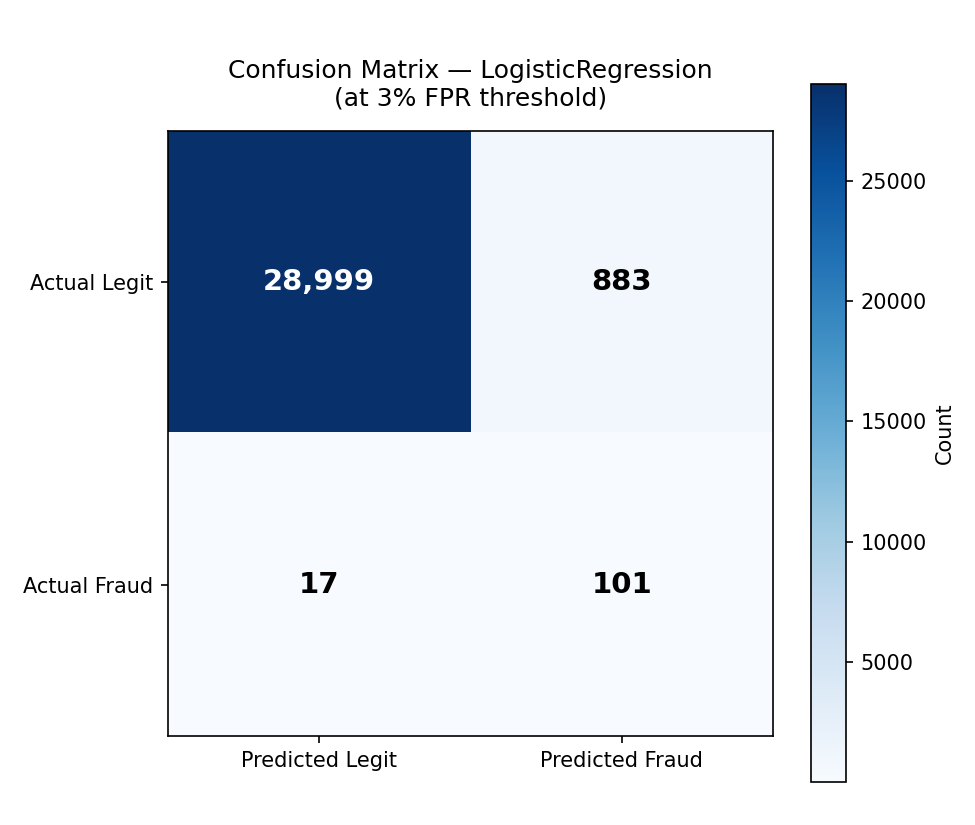

The fairness disparity chart is the one worth pausing on: a 54-point
false-positive-rate gap between geo-matched and geo-mismatched
transactions is a real, visually obvious finding, even on synthetic
data — see the DPIA (`src/privacy/dpia.md`, Section 6) for the full
discussion of what this does and doesn't establish.

---

## Real Data Results (IEEE-CIS, run locally)

Everything above is the synthetic run. This section is the same pipeline
re-run on the **real IEEE-CIS Fraud Detection dataset**, using the real
libraries (XGBoost, `imbalanced-learn` SMOTE, SHAP) instead of the
offline substitutes. Same discipline as before: a time-based split, train
on the earlier transactions and test on the later ones. Test set is
118,108 transactions containing 4,064 confirmed fraud cases. Full numbers
are in `results/metrics_real.json`.

| Model | ROC-AUC | Recall @ 3% FPR | Avg. Precision |
|---|---|---|---|
| **Random Forest (imblearn SMOTE)** | **0.748** | **16.0%** | 0.119 |
| Logistic Regression (class-weighted) | 0.742 | 5.5% | 0.083 |
| XGBoost (imblearn SMOTE) | 0.708 | 13.6% | 0.087 |
| Isolation Forest (unsupervised) | 0.689 | 5.8% | 0.065 |

### ROC curves

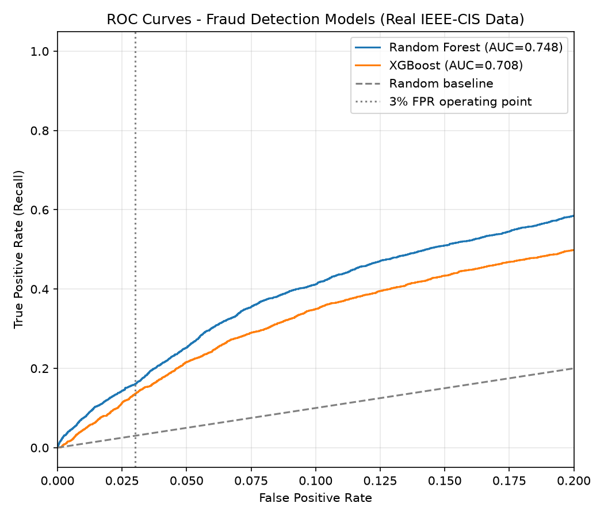

RandomForest wins at **AUC 0.748**, with XGBoost close behind at **0.708**.

These are meaningfully lower than the synthetic run's ~0.98 AUC. That gap
is expected, and it is a good sign rather than a regression: it means the
synthetic data was inflating performance. The synthetic fraud signal was
hand-designed to correlate with a handful of features, so it was
learnable in a way real fraud is not. Real fraud detection on this
dataset is genuinely harder, and ~0.75 AUC on real held-out transactions
is the honest number.

Worth noting from the table: Logistic Regression's AUC (0.742) is nearly
as high as RandomForest's, but its recall at the 3% FPR operating point
is a third of RandomForest's. AUC alone would have been misleading here —
which is why the operating-point metric is the one the model choice is
made on.

### Model comparison at a fixed false-positive budget

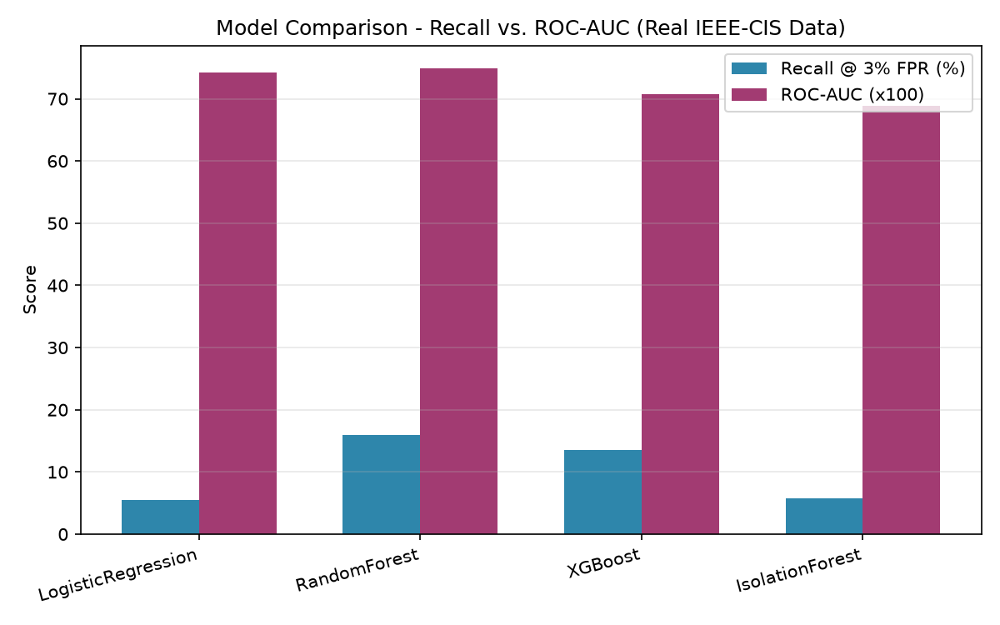

Recall @ 3% FPR against ROC-AUC for all four models. RandomForest has the
best recall: roughly **16% of fraud caught at a 3% false-positive
budget**. The 3% budget is the constraint that matters operationally — an
alert queue has finite analyst capacity, so the question is how much
fraud a model surfaces within a fixed volume of false alarms, not how it
scores on a threshold-free metric.

### Feature importance (real SHAP)

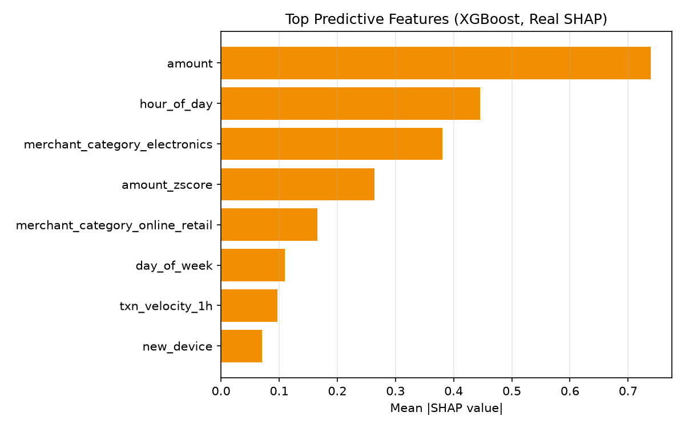

Mean |SHAP value| per feature for the XGBoost model, computed with SHAP's
`TreeExplainer` — not the permutation-importance substitute used in the
offline run. The top drivers are **`amount`**, **`hour_of_day`**, and
**`merchant_category_electronics`**. Full values in
`results/global_importance_shap.json`.

### SHAP beeswarm

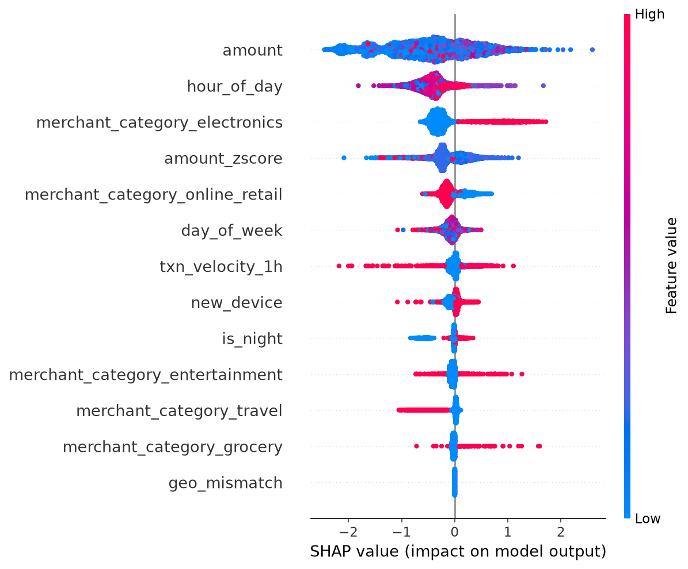

This is the real SHAP beeswarm plot (written to `results/plots/` by
`explainability_real.py`). It carries strictly more information than the
bar chart above: the bar chart is an aggregate ranking of *how much* each
feature moves predictions, while the beeswarm shows *direction and
interaction* per individual prediction. Each dot is one transaction, its
horizontal position is that feature's SHAP contribution for that
transaction, and its color is the feature's value. So you can read
whether a high `amount` pushes a prediction toward fraud or away from it,
whether that effect is consistent or splits into subpopulations, and
where a feature matters enormously for a few transactions but not on
average. That per-prediction directionality is what an aggregate
importance ranking cannot show.

### Fairness audit (real subgroup FPRs)

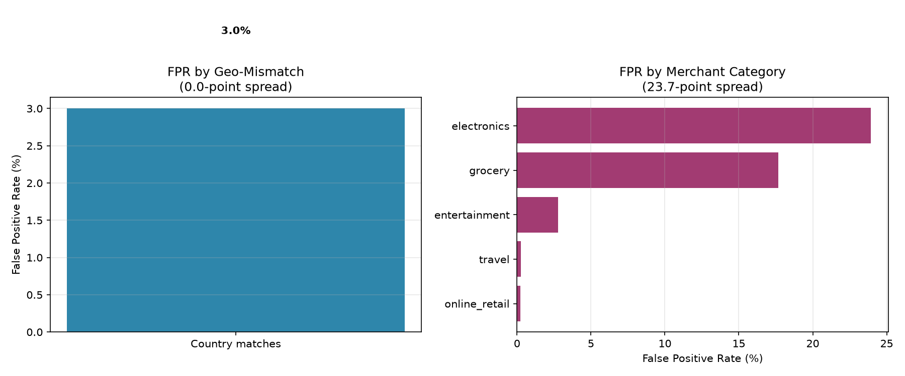

Subgroup false-positive rates on real data, from
`results/fairness_audit.json`. Two things to report, one a finding and
one a limitation.

**The real disparity is in merchant category — a 23.7-point FPR spread.**
Legitimate `electronics` transactions are flagged at 23.9% and `grocery`
at 17.7%, against 0.27% for `travel` and 0.24% for `online_retail`. That
is roughly a hundredfold difference in how often a legitimate transaction
in one category gets held up versus another. This is not automatically
unlawful discrimination — merchant category is not a protected attribute,
and some of the spread plausibly tracks genuine differences in fraud base
rates — but a disparity that large has a real customer-impact cost
concentrated on specific merchant segments, and it is flagged here as
**worth investigating before any production use**.

**The geo-mismatch panel shows a 0.0-point spread, and that is an
artifact, not a fairness result.** The IEEE-CIS dataset has no customer
identifier, so `load_ieee_cis.py` reconstructs a pseudo-identity by
hashing card and address fields (disclosed in that script and in
`LOCAL_SETUP.md`). A side effect is that a customer's derived home
country is almost always equal to their transaction country, so
`geo_mismatch` collapses to a single value across the real test set —
every legitimate transaction lands in the same subgroup. There is nothing
to compare, so the spread is 0.0 by construction. The feature is
correspondingly dead in the model as well: its mean |SHAP| is exactly
0.0. **This is a limitation of the customer-ID reconstruction heuristic,
not evidence that the model is geographically fair.**

That contrast is the point worth drawing out. The synthetic run reported
a 54-point geo-mismatch disparity, and that number was a designed
synthetic signal — the generator deliberately correlated fraud with
cross-border transactions, so the audit rediscovered an artifact of the
data generator rather than a property of fraud. On real data the same
feature turns out to carry no usable signal at all under this
reconstruction. The audit *methodology* transferred cleanly; the
synthetic *finding* did not survive contact with real data.

### Confusion matrix at the 3% FPR threshold

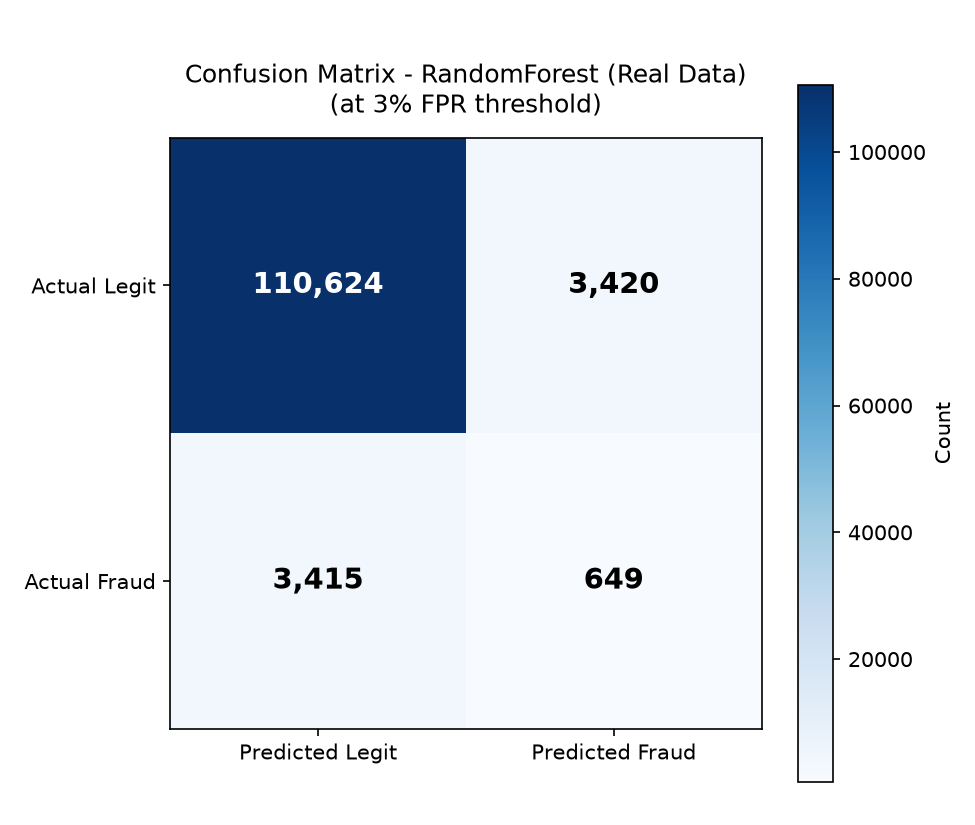

RandomForest at its 3% FPR operating point. Of the **4,064 real fraud
cases** in the held-out test set, it catches **649** and misses **3,415**,
against 3,420 false positives out of 114,044 legitimate transactions.

That is a modest recall rate, and it is stated plainly rather than framed
up: this is real, held-out, time-based-split data, so it is the number
the model would actually deliver on the next window of transactions.
Catching one fraud case in six within a fixed alert budget is a
defensible starting point for a model built on this feature set, and it
is a considerably more useful thing to be able to discuss than the
synthetic run's 85.6%.

---

## Project Structure

```
fraudsentry/
├── data/
│   ├── generate_data.py        # synthetic dataset generator (see disclosure above)
│   ├── load_ieee_cis.py        # REAL dataset loader (run on your machine w/ internet)
│   ├── transactions.csv        # generated raw data
│   └── features.csv            # engineered features
├── src/
│   ├── feature_engineering.py  # velocity, amount deviation, geo mismatch, temporal features
│   ├── smote.py                # from-scratch SMOTE implementation (offline)
│   ├── train_models.py         # trains & evaluates 4 models, time-based split (offline)
│   ├── train_models_real.py    # same, using real XGBoost + imblearn SMOTE (run locally)
│   ├── explainability.py       # permutation importance + deviation heuristic (offline)
│   ├── explainability_real.py  # real SHAP TreeExplainer (run locally)
│   ├── fairness_audit_offline.py  # subgroup FPR check — ALREADY RUN, see results/
│   ├── fairness_audit.py       # same, for real IEEE-CIS data (run locally)
│   ├── case_tracking.py        # SQLite alert/case management layer with audit trail
│   ├── investigation_analysis.py  # trend analysis + case narratives on confirmed fraud
│   └── privacy/
│       ├── dpia.md             # full GDPR Article 35 Data Protection Impact Assessment
│       └── data_subject_rights.py  # Article 15 (access) + Article 17 (erasure) implementation
├── results/                    # generated metrics, trained models, alert database
├── requirements-local.txt      # xgboost, shap, imbalanced-learn, kaggle
├── LOCAL_SETUP.md              # exact steps to run the real-library / real-data upgrade
└── README.md                   # this file
```

## How to Run

```bash
cd data && python3 generate_data.py
cd ../src && python3 feature_engineering.py
python3 train_models.py
python3 explainability.py
python3 case_tracking.py
python3 investigation_analysis.py
python3 privacy/data_subject_rights.py
```

---

## Mapping to the Original Job-Description Gaps

| Gap identified | What this project does about it |
|---|---|
| **Predictive fraud modeling** | Four models trained and honestly compared (see Results table above), with a time-based split to avoid leakage and a business-relevant metric (recall at a fixed false-positive rate) rather than just accuracy. |
| **Fraud detection systems/tools experience** | `case_tracking.py` implements the *concept* behind commercial case-management modules (alert lifecycle, analyst assignment, resolution tracking, audit trail) — genuinely useful to talk through in an interview, but explicitly **not** a substitute for hands-on experience with named commercial platforms (Actimize, SAS Fraud Management, Feedzai), which this project does not claim. |
| **Fraud investigation & trend analysis** | `investigation_analysis.py` analyzes confirmed-fraud alerts for shared patterns (merchant category, geo mismatch rate, time-of-day, velocity) and produces analyst-style case narratives with recommended actions — the actual JD language ("post-incident investigations and trend analysis to identify patterns"). |
| **Data privacy regulations** | `src/privacy/dpia.md` is a full, structured GDPR Article 35 DPIA — necessity/proportionality assessment, identified risks, mitigations, retention policy, and **honestly documented gaps** (no fairness audit was run; no DPO/supervisory-authority review occurred, since this isn't a live deployment). `data_subject_rights.py` operationalizes Article 15 (access) and Article 17 (erasure), including the retention-conflict logic real erasure requests require (Article 17(3)(b)) rather than naively deleting everything on request. |

---

## What This Project Does NOT Claim

Being direct about this, since it matters:

- **Not real production experience.** This is project-based learning against synthetic data, not professional fraud-analyst casework with real stakes, real ambiguity, or a real stakeholder who can push back on a conclusion.
- **Not experience with named commercial fraud platforms** (Actimize, SAS Fraud Management, Feedzai, etc.). The case-tracking layer demonstrates understanding of the underlying concepts, not hands-on tool experience.
- **Not a completed privacy/compliance certification.** The DPIA is methodologically real, but it hasn't been reviewed by a DPO or supervisory authority, because there is no live deployment or organization behind it.
- **Not a fraud-specific credential** (e.g., CFE). This project doesn't touch certification requirements at all.
