# FraudSentry: Transaction Fraud Detection and Investigation Pipeline

A fraud-detection pipeline covering predictive fraud modeling, a
fraud-alert case-tracking layer, post-incident investigation and trend
analysis, and a GDPR Data Protection Impact Assessment.

**This is a personal learning project. It is not a claim of professional
fraud-analyst experience, commercial fraud-platform experience, or a
completed compliance certification.** See "What This Project Does NOT
Claim" at the bottom.

---

## Data Source Disclosure (read this first)

The first version was built in a sandboxed environment with **no internet
access**, so the planned public datasets (Kaggle Credit Card Fraud
Detection / IEEE-CIS Fraud Detection) could not be downloaded there.

Instead, `data/generate_data.py` generates a **synthetic** transaction
dataset (150,000 transactions, 8,000 customers, 0.45% fraud rate). Its
fraud patterns follow publicly documented traits of card-fraud data:
cross-border transactions, new-device usage, late-night timing, and
elevated-risk merchant categories (jewelry, electronics, online retail,
travel) all raise fraud likelihood.

The modeling, feature engineering, and analysis code is the same code
that would run against real data. Only the data source differs, and
`generate_data.py` can be swapped for another dataset loader without other
pipeline changes.

Three dependencies could not be installed offline and were replaced with
disclosed substitutes:
- **`imbalanced-learn` (SMOTE)** → `src/smote.py`, a from-scratch
  implementation of the published SMOTE algorithm (Chawla et al., 2002).
- **`xgboost`** → scikit-learn's `HistGradientBoostingClassifier`, from
  the same algorithm family.
- **`shap`** → `sklearn.inspection.permutation_importance` for global
  explainability, plus a deviation-based heuristic for per-alert local
  explanations. The docstring in `src/explainability.py` notes the cost:
  SHAP's Shapley-value attribution accounts for feature interactions and
  this simpler method does not.

The pipeline was later re-run on a local machine against the IEEE-CIS
dataset with XGBoost, `imbalanced-learn` and SHAP. Those results are in
"IEEE-CIS Data Results" below, and `LOCAL_SETUP.md` has the steps.

---

## Results (synthetic run, see `results/metrics.json` for full detail)

Evaluation uses a **time-based split**: train on the first 80% of
transactions by timestamp, test on the last 20%. A random split would
leak future fraud patterns into training and overstate performance.

| Model | ROC-AUC | Recall @ 3% FPR | Achieved FPR |
|---|---|---|---|
| **Logistic Regression (class-weighted)** | 0.983 | **85.6%** | 2.95% |
| Random Forest (SMOTE-balanced) | 0.979 | 79.7% | 3.00% |
| HistGradientBoosting (SMOTE-balanced) | 0.978 | 79.7% | 2.98% |
| Isolation Forest (unsupervised, no labels used) | 0.961 | 55.1% | 2.94% |

The simplest model (Logistic Regression) beat the more complex ones at
this operating point. With a moderate feature set and severe class
imbalance, extra model complexity did not help.

---

## Visualizations

Generated from the synthetic-data run via `src/visualize.py`:

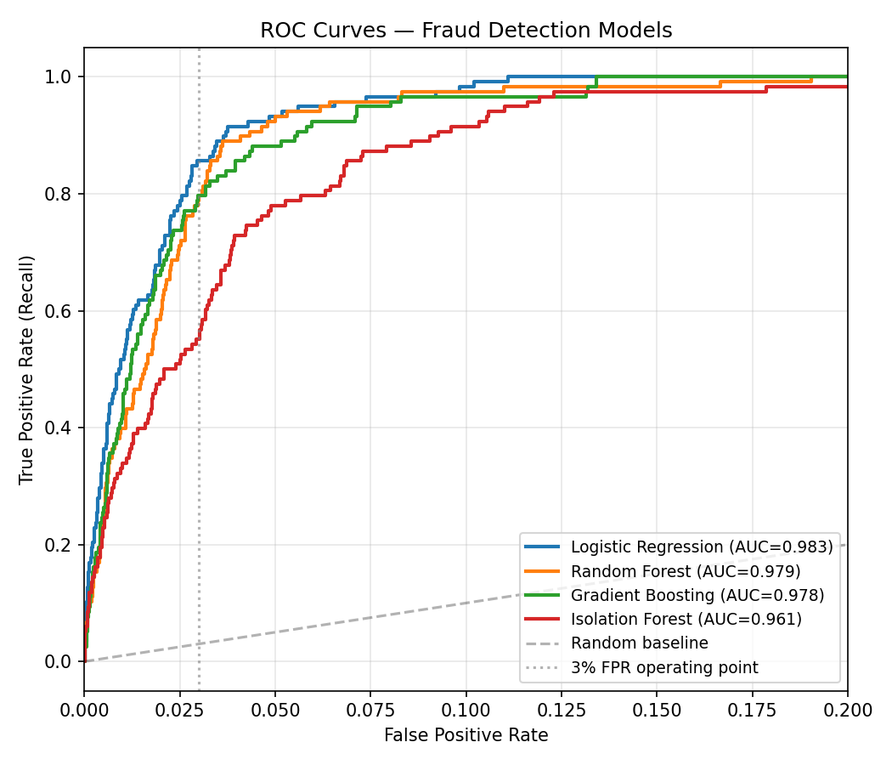

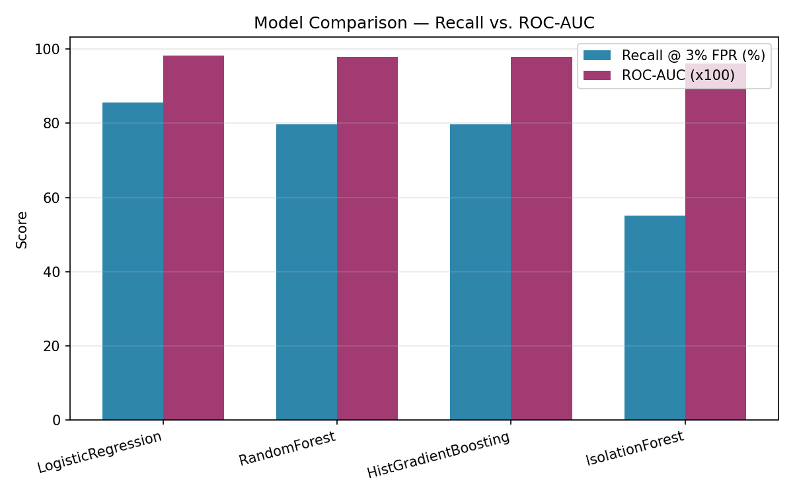

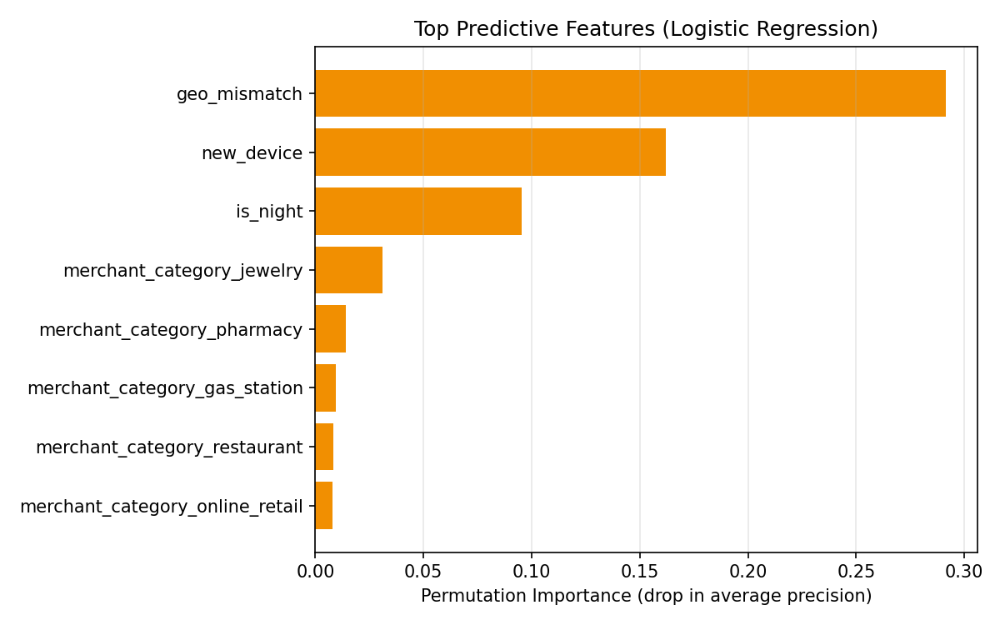

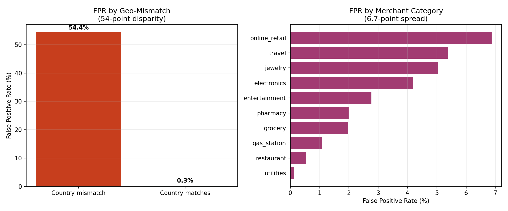

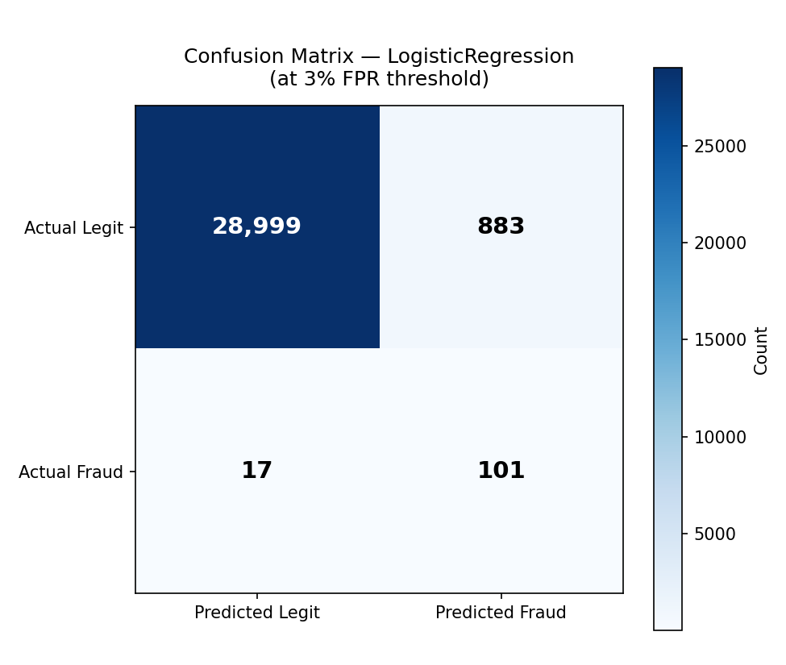

The fairness disparity chart comes from `src/fairness_audit_offline.py`
(results in `results/fairness_audit_synthetic.json`), which compares
subgroup false-positive rates for the Random Forest model at the 3% FPR
threshold. Legitimate transactions with a country mismatch were flagged
at 54.4%, against 0.30% for matched-country transactions, a 54-point
spread. Merchant categories showed a 6.7-point spread. The synthetic
fraud signal was hand-designed to correlate with these exact features, so
the geo result is partly circular. Section 6 of the DPIA
(`src/privacy/dpia.md`) covers what it does and does not establish.

---

## IEEE-CIS Data Results (run locally)

This section is the same pipeline re-run on the **IEEE-CIS Fraud
Detection dataset**, using XGBoost, `imbalanced-learn` SMOTE and SHAP
instead of the offline substitutes. The split is again time-based: train
on the earlier transactions and test on the later ones. The test set is
118,108 transactions containing 4,064 confirmed fraud cases. Full numbers
are in `results/metrics_real.json`.

| Model | ROC-AUC | Recall @ 3% FPR | Avg. Precision |
|---|---|---|---|
| **Random Forest (imblearn SMOTE)** | **0.748** | **16.0%** | 0.119 |
| Logistic Regression (class-weighted) | 0.742 | 5.5% | 0.083 |
| XGBoost (imblearn SMOTE) | 0.708 | 13.6% | 0.087 |
| Isolation Forest (unsupervised) | 0.689 | 5.8% | 0.065 |

### ROC curves

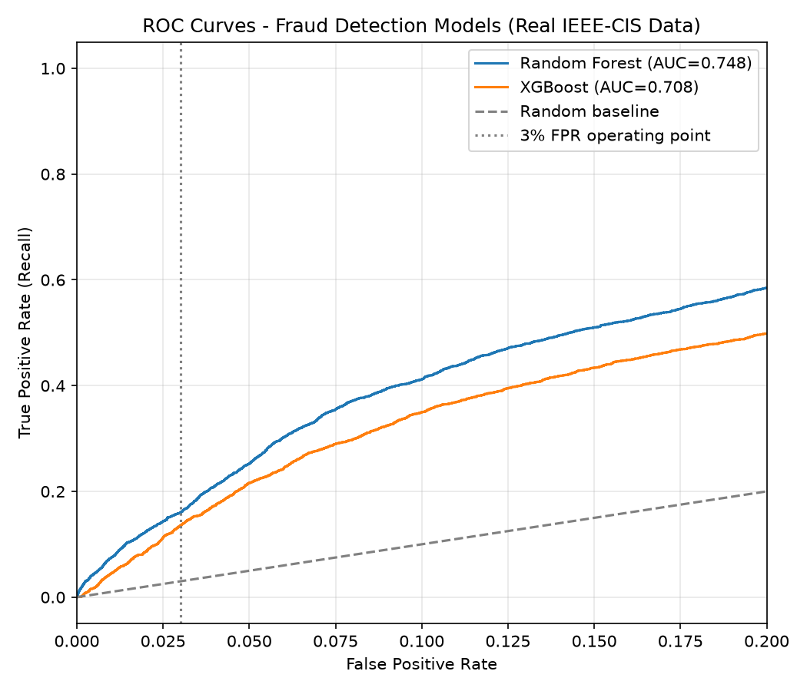

RandomForest wins at **AUC 0.748**, with XGBoost behind at **0.708**.

Both are well below the synthetic run's ~0.98 AUC. That gap is expected:
the synthetic fraud signal was hand-designed to correlate with a handful
of features, so it was learnable in a way real fraud is not. About 0.75
AUC on held-out IEEE-CIS transactions is the number to quote.

Logistic Regression's AUC (0.742) is nearly as high as RandomForest's,
yet its recall at the 3% FPR operating point is a third of
RandomForest's. AUC alone would have been misleading here, which is why
the model choice is made on the operating-point metric.

### Model comparison at a fixed false-positive budget

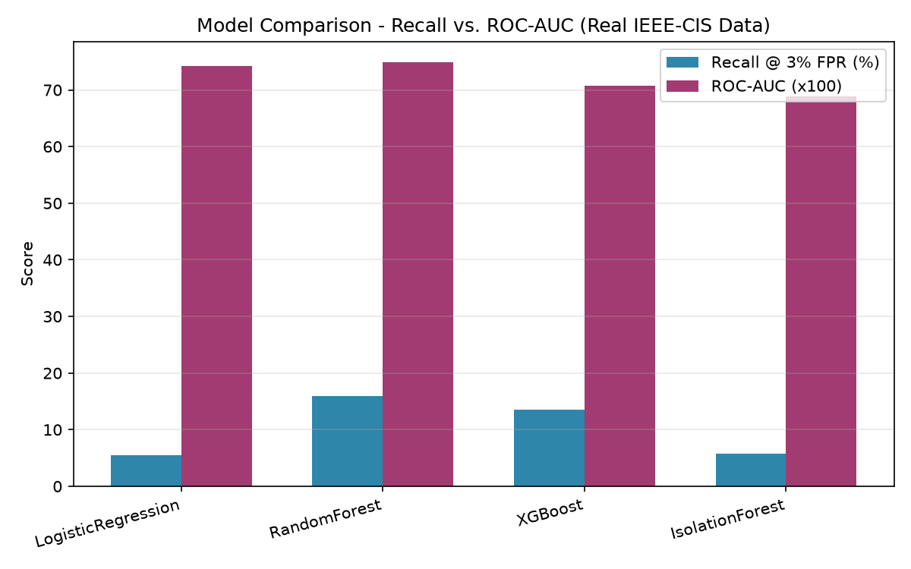

Recall @ 3% FPR against ROC-AUC for all four models. RandomForest has the
best recall, catching roughly **16% of fraud at a 3% false-positive
budget**. That budget is the constraint that matters operationally. An
alert queue has finite analyst capacity, so the useful question is how
much fraud a model surfaces within a fixed volume of false alarms.

### Feature importance (SHAP)

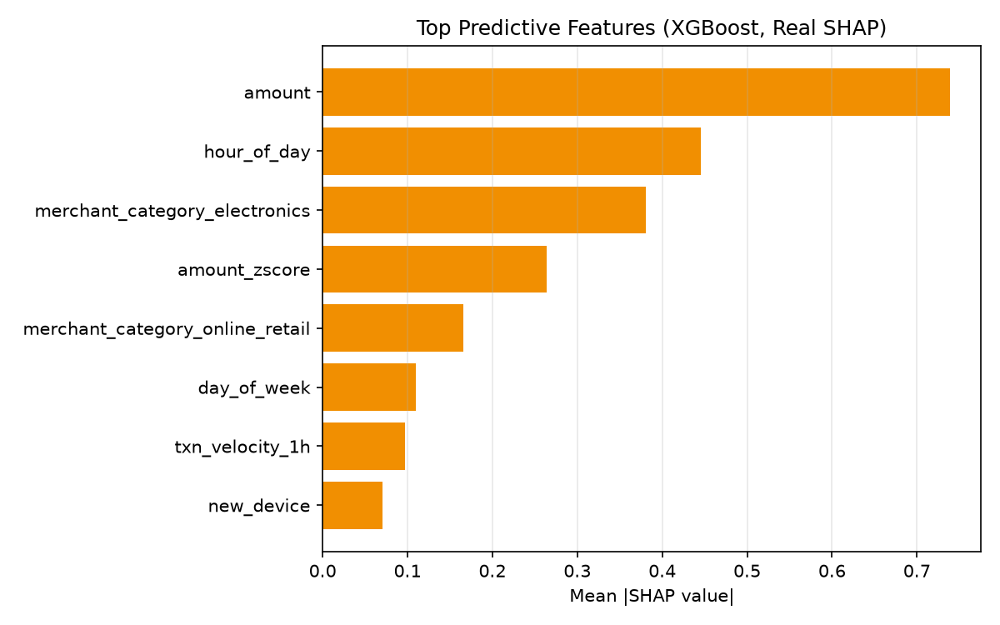

Mean |SHAP value| per feature for the XGBoost model, computed with SHAP's
`TreeExplainer` instead of the permutation-importance substitute used in
the offline run. The top drivers are **`amount`**, **`hour_of_day`**, and
**`merchant_category_electronics`**. Full values are in
`results/global_importance_shap.json`.

### SHAP beeswarm

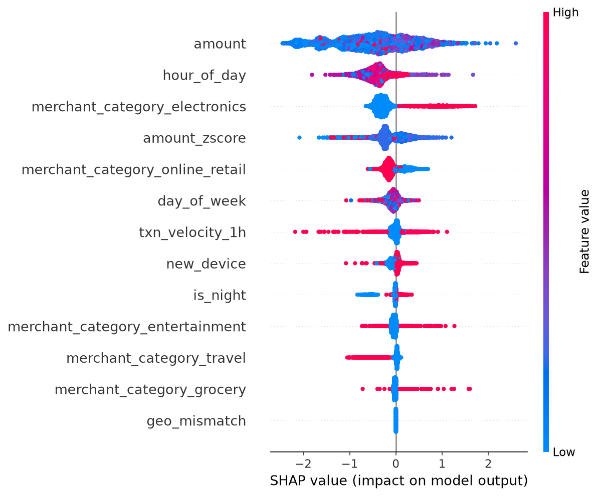

`explainability_real.py` writes this beeswarm plot to `results/plots/`.
Each dot is one transaction, placed by that feature's SHAP contribution
and colored by the feature's value, so it shows the direction of each
feature's effect per prediction (for example, whether a high `amount`
pushes toward fraud), which the bar chart above cannot.

### Fairness audit (subgroup FPRs)

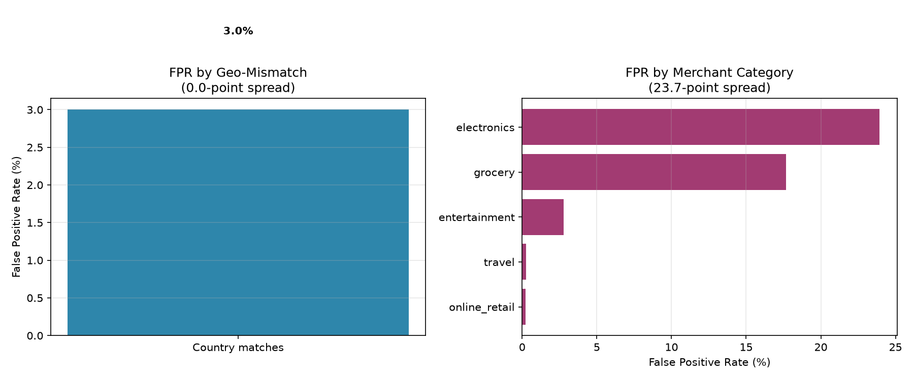

Subgroup false-positive rates for the XGBoost model at its 3% FPR
threshold, from `results/fairness_audit.json`. There is one finding and
one limitation.

**The disparity on IEEE-CIS data is in merchant category: a 23.7-point FPR
spread.** Legitimate `electronics` transactions are flagged at 23.9% and
`grocery` at 17.7%, against 0.27% for `travel` and 0.24% for
`online_retail`. That is roughly a hundredfold difference in how often a
legitimate transaction in one category gets held up versus another.
Merchant category is not a protected attribute, and some of the spread
plausibly tracks differences in fraud base rates, so this is not
automatically unlawful discrimination. A disparity that large still puts
a customer-impact cost on specific merchant segments, and it should be
**investigated before any production use**.

**The geo-mismatch panel shows a 0.0-point spread, which is an artifact
and not a fairness result.** The IEEE-CIS dataset has no customer
identifier, so `load_ieee_cis.py` reconstructs a pseudo-identity by
hashing card and address fields (disclosed in that script and in
`LOCAL_SETUP.md`). As a side effect, a customer's derived home country
almost always equals their transaction country, so `geo_mismatch`
collapses to a single value across the test set and every legitimate
transaction lands in the same subgroup. With nothing to compare, the
spread is 0.0 by construction. The feature is also dead in the model:
its mean |SHAP| is exactly 0.0. **This is a limitation of the
customer-ID reconstruction heuristic, not evidence that the model is
geographically fair.**

The synthetic run's 54-point geo-mismatch disparity was a designed
signal. The generator correlated fraud with cross-border transactions,
so the audit rediscovered a property of the generator. On IEEE-CIS data the
same feature carries no usable signal under this reconstruction. The
audit method transferred to IEEE-CIS data; the synthetic finding did not.

### Confusion matrix at the 3% FPR threshold

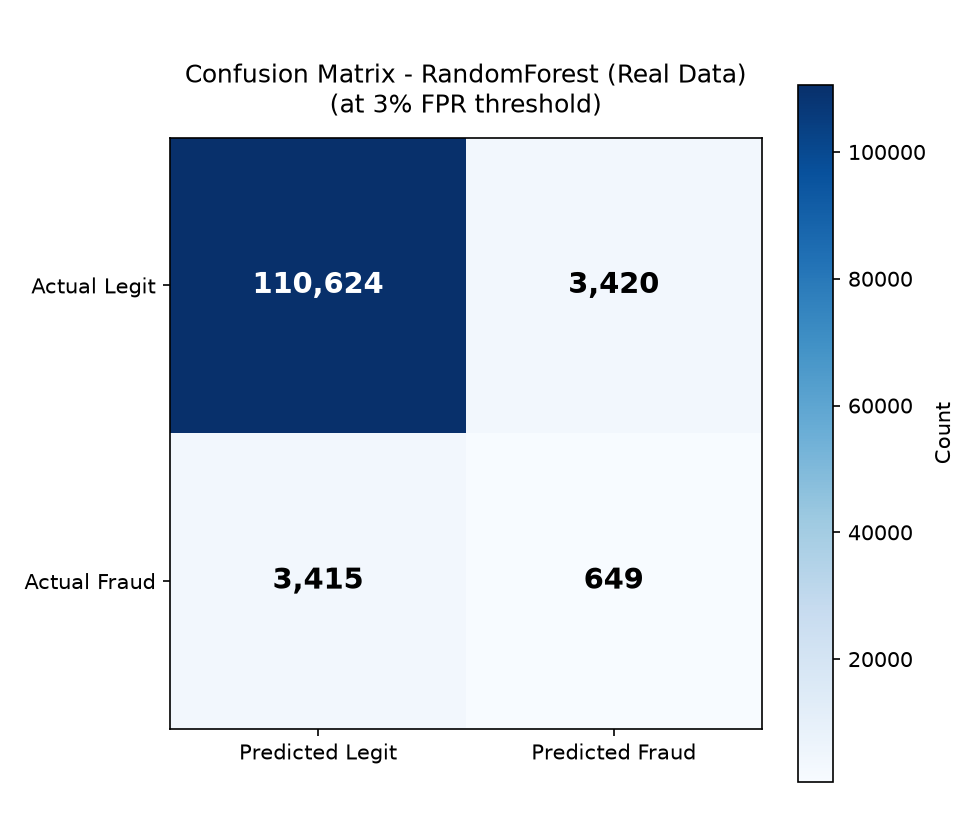

RandomForest at its 3% FPR operating point. Of the **4,064 fraud cases**
in the held-out test set, it catches **649** and misses **3,415**, with
3,420 false positives out of 114,044 legitimate transactions.

That is modest recall. Because this is held-out data from a time-based
split, it is the number the model would deliver on the next window of
transactions. Catching one fraud case in six within a fixed alert budget
is a defensible starting point for this feature set, and a more useful
number to discuss than the synthetic run's 85.6%.

---

## Project Structure

```
fraudsentry/
├── data/
│   ├── generate_data.py        # synthetic dataset generator (see disclosure above)
│   ├── load_ieee_cis.py        # IEEE-CIS dataset loader (needs internet + Kaggle API)
│   ├── transactions.csv        # generated raw data
│   └── features.csv            # engineered features
├── src/
│   ├── feature_engineering.py  # velocity, amount deviation, geo mismatch, temporal features
│   ├── smote.py                # from-scratch SMOTE implementation (offline)
│   ├── train_models.py         # trains & evaluates 4 models, time-based split (offline)
│   ├── train_models_real.py    # same, using XGBoost + imblearn SMOTE
│   ├── explainability.py       # permutation importance + deviation heuristic (offline)
│   ├── explainability_real.py  # SHAP TreeExplainer
│   ├── fairness_audit_offline.py  # subgroup FPR check on synthetic data
│   ├── fairness_audit.py       # same, for IEEE-CIS data
│   ├── visualize.py            # plots for the synthetic run
│   ├── visualize_real.py       # plots for the IEEE-CIS run
│   ├── case_tracking.py        # SQLite alert/case management layer with audit trail
│   ├── investigation_analysis.py  # trend analysis + case narratives on confirmed fraud
│   └── privacy/
│       ├── dpia.md             # GDPR Article 35 Data Protection Impact Assessment
│       └── data_subject_rights.py  # Article 15 (access) + Article 17 (erasure) implementation
├── results/                    # generated metrics, trained models, alert database
├── requirements-local.txt      # xgboost, shap, imbalanced-learn, kaggle
├── LOCAL_SETUP.md              # steps to run the IEEE-CIS / standard-library pipeline
└── README.md                   # this file
```

## How to Run

Synthetic pipeline (no internet needed):

```bash
cd data && python3 generate_data.py
cd ../src && python3 feature_engineering.py
python3 train_models.py
python3 explainability.py
python3 case_tracking.py
python3 investigation_analysis.py
python3 privacy/data_subject_rights.py
```

For the IEEE-CIS pipeline, see `LOCAL_SETUP.md`.

---

## What the Project Covers

| Area | What this project does |
|---|---|
| **Predictive fraud modeling** | Four models trained and compared (see the Results tables above), with a time-based split to avoid leakage and recall at a fixed false-positive rate as the deciding metric instead of accuracy. |
| **Fraud detection tooling** | `case_tracking.py` implements the concept behind commercial case-management modules (alert lifecycle, analyst assignment, resolution tracking, audit trail). It is **not** a substitute for hands-on experience with commercial platforms such as Actimize, SAS Fraud Management or Feedzai, which this project does not claim. |
| **Fraud investigation and trend analysis** | `investigation_analysis.py` analyzes confirmed-fraud alerts for shared patterns (merchant category, geo mismatch rate, time-of-day, velocity) and produces analyst-style case narratives with recommended actions. |
| **Data privacy regulations** | `src/privacy/dpia.md` is a structured GDPR Article 35 DPIA covering necessity and proportionality, identified risks, mitigations, a retention policy, the subgroup fairness audits on synthetic and IEEE-CIS data, and the remaining gaps (no DPO or supervisory-authority review, since this isn't a live deployment). `data_subject_rights.py` implements Article 15 (access) and Article 17 (erasure), including the retention-conflict logic erasure requests require under Article 17(3)(b) instead of deleting everything on request. |

---

## What This Project Does NOT Claim

- **Not production experience.** This is project-based learning on synthetic and public data, not professional fraud-analyst casework with stakes, ambiguity, or a stakeholder who can push back on a conclusion.
- **No experience with named commercial fraud platforms** (Actimize, SAS Fraud Management, Feedzai, etc.). The case-tracking layer shows the underlying concepts, not hands-on tool experience.
- **Not a completed privacy/compliance certification.** The DPIA follows the Article 35 method, but no DPO or supervisory authority has reviewed it, because there is no live deployment or organization behind it.
- **Not a fraud-specific credential** (e.g., CFE). This project doesn't touch certification requirements.
